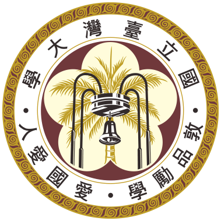

# About Me

  

I’m *Laurance Lin*, currently a third-year undergraduate at National Taiwan University, majoring in Information Management with a secondary focus on Economics. I’m particularly interested in the application of machine learning and econometric techniques to problems in quantitative finance and business analytics. 

---

<h2 style="font-variant: small-caps;"> Education </h2>

**National Taiwan University (NTU)** 
B.B.A. in Information Management 
2022 – Present 
Honors: Dean’s List (2022 Fall, 2023 Fall), Presidential Award (2024)

**The Affiliated Senior High School of National Taiwan Normal University (HSNU)** 
High School Diploma 
2019 – 2022 
Honors: Mayor’s Award (Graduated first in class)

---

I’d love to discuss ideas or potential collaborations — feel free to reach out via [LinkedIn](https://linkedin.com/in/LauranceLin) or [email](mailto:b11705050@ntu.edu.tw).
